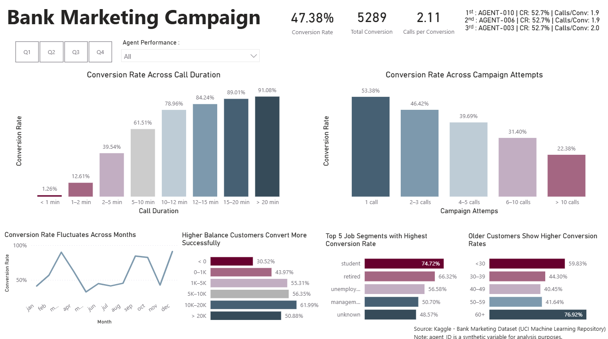

# Bank Marketing Campaign Analysis

## Overview

This project analyzes a bank's direct marketing campaign dataset to evaluate campaign effectiveness and identify key drivers of customer conversion.

To enhance the analysis, a synthetic **agentID** variable was introduced to simulate telemarketing operations. This allows evaluation of agent-level performance alongside campaign and customer insights.

The project reflects a real-world analytical scenario combining **campaign performance**, **customer segmentation**, and **operational analysis**.

## Objectives

* Evaluate marketing campaign effectiveness
* Identify factors influencing conversion rate
* Analyze customer characteristics linked to higher conversion
* Assess telemarketing agent performance
* Provide actionable business recommendations


## Dataset

* Source: Bank Marketing Dataset, UCI Machine Learning Repository
* Original dataset file: `bank.csv`
* Link: https://www.kaggle.com/datasets/janiobachmann/bank-marketing-dataset


The dataset includes:

* Customer demographics (age, job, marital status, education)
* Financial information (balance)
* Campaign details (duration, number of contacts, previous outcome)
* Target variable (term deposit subscription)

> Note: Data transformation and feature engineering (including `agentID`) were performed within Power BI.


## Tools Used
* Power BI → Data visualization & dashboard development
* Microsoft Excel / CSV → Data preprocessing support


## Dashboard Focus

### Campaign Performance Analysis

The main analysis evaluates how marketing strategies influence conversion rate:

* **Conversion Rate by Call Duration**
* **Conversion Rate by Campaign**

This highlights the relationship between customer engagement and campaign effectiveness.


### Customer Profile Analysis

Customer segmentation is performed using:

* **Balance**
* **Job**
* **Age**

This helps identify high-potential customer groups for targeted campaigns.


### Agent Performance Analysis

With the addition of the synthetic `agentID`, the analysis includes:

* Conversion performance by agent
* Identification of **top-performing agents**
* Comparison of agent effectiveness

## Dashboard Features

* Conversion Rate overview
* Conversion analysis by Duration and Campaign
* Customer segmentation (Balance, Job, Age)
* Agent performance analysis
* Interactive filters for dynamic exploration

## Dashboard Preview




## Key Insights

* Longer call duration is strongly associated with higher conversion rates
* Increasing contact frequency does not always improve outcomes
* Certain customer segments show higher likelihood of conversion
* A small number of agents contribute disproportionately to successful conversions


## Business Recommendations

* Focus on high-converting customer segments
* Optimize call duration to improve engagement quality
* Improve campaign targeting to reduce inefficiencies
* Leverage top-performing agents as benchmarks

## How to Use

1. Download the `.pbix` file from this repository
2. Open in Power BI Desktop
3. Explore the dashboard using filters and slicers


## Repository Structure

```
bank-marketing-campaign-analysis/
│
├── data/
│   └── bank.csv
│
├── dashboard/
│   └── bank-marketing-dashboard.pbix
│
├── images/
│   └── dashboard-preview.png
│
├── README.md
└── LICENSE
```


## License

This project is licensed under the Apache License 2.0.
See the `LICENSE` file for details.


## Acknowledgement

This project uses the **Bank Marketing Dataset** from the UCI Machine Learning Repository, accessed via Kaggle:
https://www.kaggle.com/datasets/janiobachmann/bank-marketing-dataset

Moro, S., Cortez, P., & Rita, P. (2014).
*A Data-Driven Approach to Predict the Success of Bank Telemarketing*.
Decision Support Systems, 62, 22–31.

A synthetic **agentID** variable was created for analytical purposes and does not represent real-world data.
